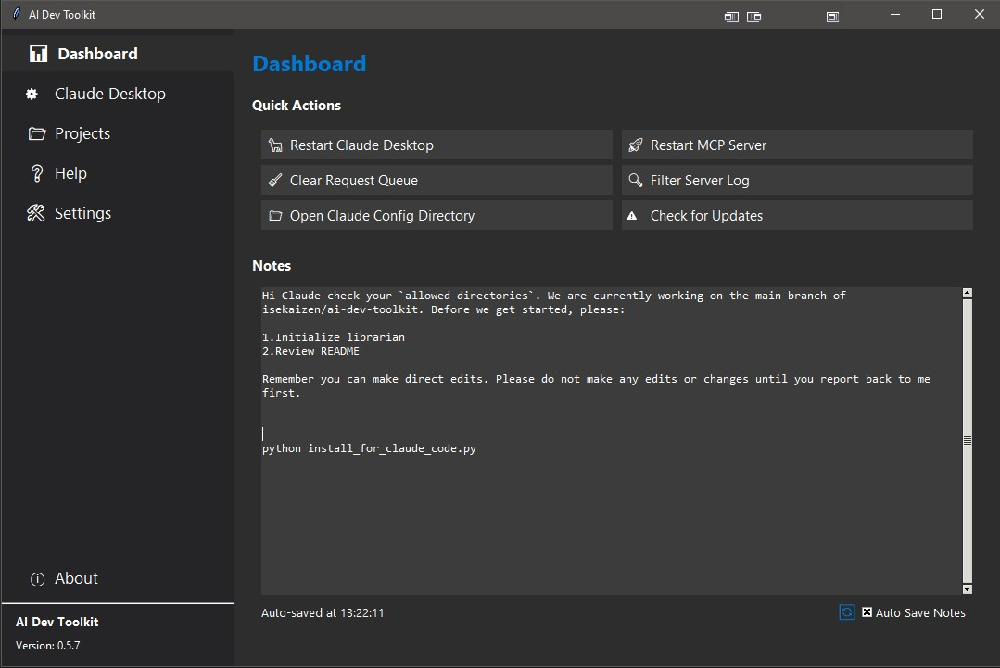
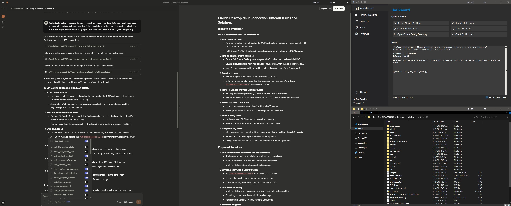
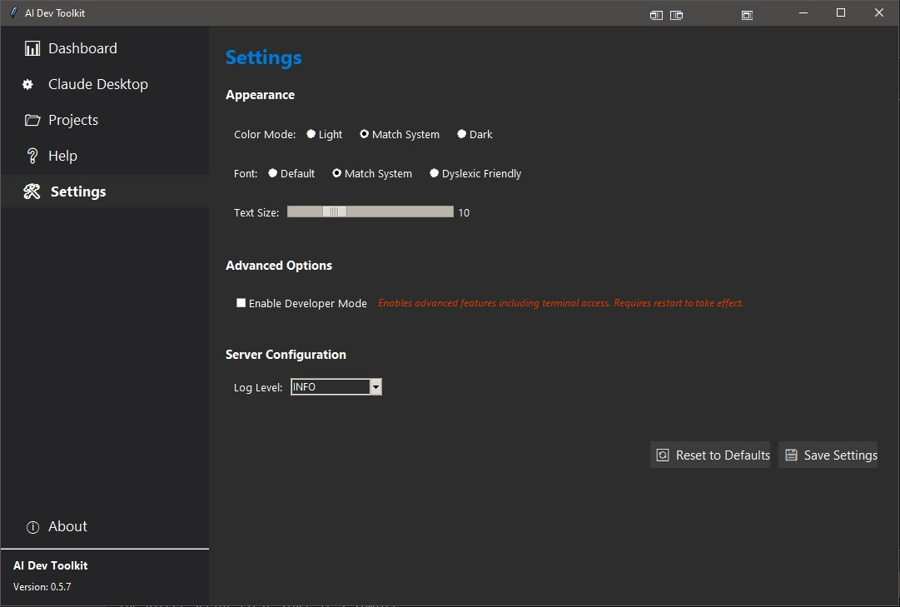
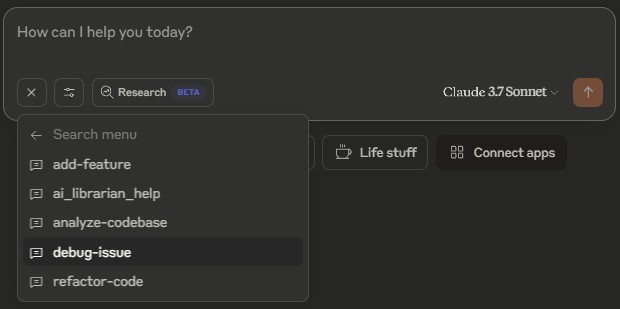
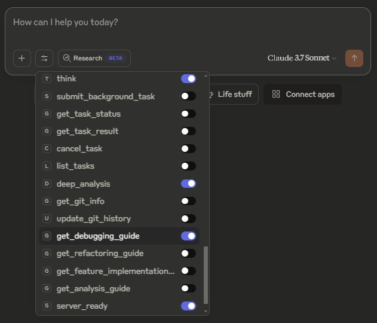
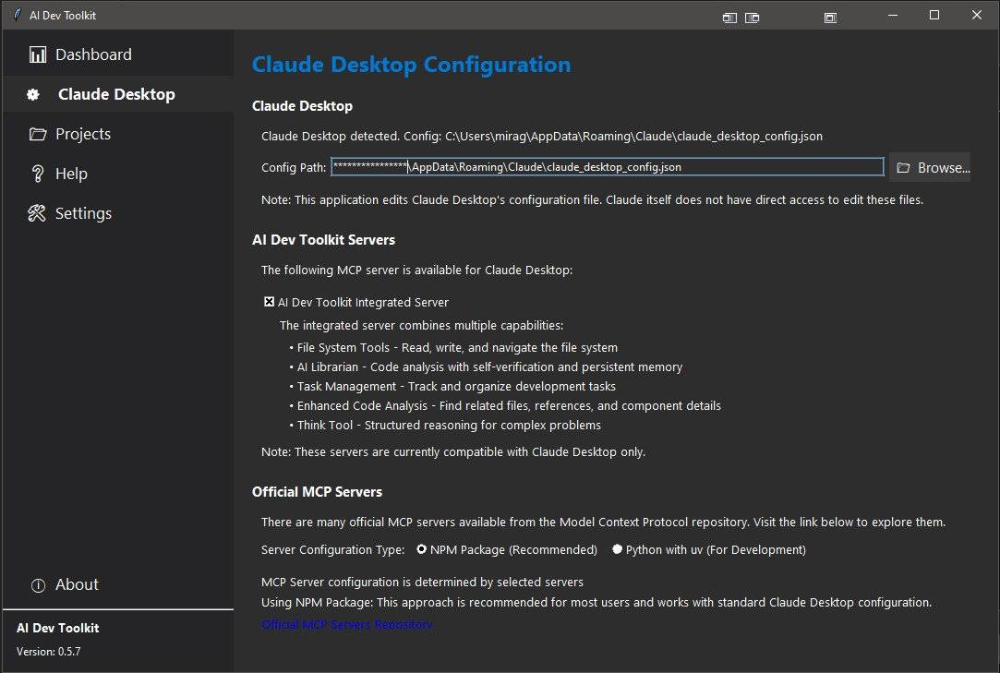

<meta name="image" property="og:image" content="https://repository-images.githubusercontent.com/646493172/e8e7f5da-2f76-47c7-abef-33e95adac306" />
<meta property="og:title" content="AI Dev Toolkit" />
<meta property="og:description" content="A comprehensive system that enhances AI assistants with persistent code understanding, filesystem access, and task management." />

# AI Dev Toolkit


> ⚠️ **Alpha Testing Phase**: This toolkit is currently optimizing its tool architecture. The system internally manages 43+ operations through 17 high-level orchestrator tools, reducing complexity while maintaining full functionality.

A powerful, extensible toolkit that dramatically enhances Claude's capabilities with persistent context, filesystem access, development tools, and AI-optimized task management.

<div align="center">
  
</div>

## 📑 Quick Navigation

- [Overview](#-overview)
- [AI-Assisted Development](#-ai-assisted-development)
- [Architecture](#-architecture)
- [Features](#-features)
- [Screenshots](#-screenshots)
- [Installation](#-installation)
- [How to Use AI Dev Toolkit](#-how-to-use-ai-dev-toolkit)
- [Claude's Technical Implementation](#-claudes-technical-implementation) (Collapsible)
- [Troubleshooting](#-troubleshooting) (Collapsible)
- [Documentation](#-documentation) (Collapsible)
- [Roadmap](#-roadmap) (Collapsible)
- [License](#-license)
- [Acknowledgments](#-acknowledgments)

## 🌟 Overview

AI Dev Toolkit elevates Claude beyond a conversational assistant to a comprehensive development partner. The toolkit creates a bidirectional bridge between your projects and Claude, enabling it to:

- **Understand your codebase** through persistent context that spans conversations
- **Access and modify your filesystem** with appropriate permissions
- **Track and manage development tasks** with sophisticated context awareness
- **Navigate between code and tools** with unified context awareness
- **Offload complex cognitive tasks** to specialized AI mini-librarians
- **Process long-running operations asynchronously** with the TaskBoard system
- **Analyze codebase security** with professional-level vulnerability assessment
- **Create a seamless development workflow** within Claude's interface

With this toolkit, Claude becomes a true development partner - remembering your project structure, understanding component relationships, connecting code to relevant tools, tracking tasks, and assisting with development activities.

All this happens automatically - just initialize once and the system handles everything behind the scenes, continuously updating its understanding of your codebase as it evolves. **You don't need to manually call any functions or understand the internal implementation - Claude handles all of this for you.**

## 🤖 AI-Assisted Development

This toolkit was developed with Claude's assistance, demonstrating the power of human-AI collaboration in creating developer tools. The project itself serves as an example of enhancing AI capabilities through specialized extensions.

Key AI-assisted development techniques used in this project:

- **Iterative Design**: Human-AI dialogue to refine architecture and interfaces
- **Context-Aware Coding**: Using AI Librarian to maintain project context
- **Specialized AI Agents**: Mini-librarians handling specific cognitive tasks
- **Task Decomposition**: Breaking complex problems into manageable chunks
- **Knowledge Integration**: Combining domain expertise with AI capabilities

## 🔌 Architecture

The AI Dev Toolkit uses a modular architecture built around the Model Context Protocol (MCP) to integrate with Claude:

### Intelligent Tool Orchestration

The toolkit employs an advanced orchestration pattern that simplifies interaction while maintaining powerful functionality:

- **High-Level Tools (17)**: User-facing tools that handle common development tasks
  - `project_setup` - Initialize and configure projects
  - `code_analysis` - Understand and analyze code
  - `code_modification` - Make intelligent code changes
  - `task_management` - Track and manage development tasks
  - `project_exploration` - Navigate and search projects

- **Internal Operations (43+)**: Behind the scenes, these high-level tools orchestrate multiple internal operations:
  - File operations (read, write, edit, move)
  - Component analysis (query, find implementations)
  - Task tracking (todos, subtasks, priorities)
  - Git operations (history, branches, commits)
  - And many more...

The orchestration happens automatically - Claude determines the best execution strategy based on your request, handles timeouts gracefully, and caches results for optimal performance.

### Claude Desktop Architecture
```
┌───────────────────┐      ┌───────────────┐      ┌───────────┐
│                   │      │               │      │           │
│   Claude Desktop  │◄────►│   AI Librarian│◄────►│Your Project│
│                   │      │     Server    │      │  Filesystem│
└───────────────────┘      └───────────────┘      └───────────┘
                                  ▲
                                  │
                                  ▼
                        ┌─────────────────────┐
                        │                     │
                        │  Unified Context System│
                        │                     │
                        └─────────────────────┘
                                  ▲
                                  │
                                  ▼
                  ┌────────────────┐     ┌────────────────┐
                  │                │     │                │
                  │ AI Librarian   │◄───►│  Tool Reference│
                  │ Persistent     │     │  System        │
                  │ Context        │     │                │
                  └────────────────┘     └────────────────┘
```

### Claude Code Architecture
```
┌───────────────────┐      ┌───────────────┐      ┌───────────┐
│                   │      │ Built-in Tools│      │           │
│   Claude Code     │◄────►│ + AI Librarian│◄────►│Your Project│
│                   │      │   Components  │      │  Filesystem│
└───────────────────┘      └───────────────┘      └───────────┘
                                  ▲
                                  │
                                  ▼
                        ┌─────────────────────┐
                        │                     │
                        │ .ai_reference/      │
                        │ Mini-Librarians     │
                        └─────────────────────┘
                                  ▲
                                  │
                                  ▼
                  ┌────────────────┐     ┌────────────────┐
                  │                │     │                │
                  │ AI Librarian   │◄───►│  Tool Reference│
                  │ Persistent     │     │  System        │
                  │ Context        │     │                │
                  └────────────────┘     └────────────────┘
```

The AI Librarian components provide a seamless interface between Claude and your project. The Unified Context System automatically bridges the AI Librarian's code understanding with the Tool Reference System, enabling intelligent navigation between components and tools without any manual configuration.

Claude Code can directly access Mini-Librarians through its file system tools, while Claude Desktop requires the MCP server to access these components.

## 🚀 Features

> **Note:** The GUI components are currently under development. Claude Desktop features are in pre-beta phase, while Claude Code features have more streamlined implementation. Feature stability is indicated for each component.

<details>
<summary style="color: #0366d6; font-weight: bold; cursor: pointer;">🧠 AI Librarian Server</summary>

- **Integrated Architecture**: All capabilities consolidated in one AI Librarian server *(Stable: Code, Pre-Beta: Desktop)*
- **Simplified Setup**: One-step installation to Claude Desktop/Code *(Stable: Code, Beta: Desktop)*
- **Optimized Performance**: Reduced overhead and faster response times *(Stable)*
- **Full MCP Compliance**: Complete implementation of Model Context Protocol standards *(Stable: Desktop)*
- **Tool Index Integration**: AI-optimized tool selection and usage guidance *(Stable)*
</details>

<details>
<summary style="color: #0366d6; font-weight: bold; cursor: pointer;">📚 AI Librarian</summary>

- **Code Understanding**: Comprehensive codebase indexing with component tracking *(Stable)*
- **Persistent Context**: Code structure awareness persists across conversations *(Stable)*
- **Component Relationship Analysis**: Automatically detects dependencies and relationships *(Stable)*
- **Documentation Generation**: Extracts docstrings and creates documentation *(Stable)*
- **Real-time Updates**: Monitors project changes automatically to stay current *(Stable)*
- **Mini-Librarians**: Handle large codebases by breaking them into specialized knowledge units *(Stable: Code, Beta: Desktop)*
</details>

<details>
<summary style="color: #0366d6; font-weight: bold; cursor: pointer;">🔄 Unified Context System</summary>

- **Automatic Integration**: Zero manual setup - just initialize and everything works *(Stable)*
- **Code-Tool Bridging**: Intelligently connects code components to relevant tools *(Stable)*
- **Bidirectional References**: Navigate from components to tools and vice versa *(Stable)*
- **Context Awareness**: Understands which tools are most useful for specific code *(Stable)*
- **Background Maintenance**: Continuously updates cross-references as code evolves *(Stable)*
</details>

<details>
<summary style="color: #0366d6; font-weight: bold; cursor: pointer;">🔍 Enhanced Code Analysis</summary>

- **Reference Finding**: Locate all references to components across the codebase *(Stable)*
- **Pattern Detection**: Identify common patterns and anti-patterns *(Stable)*
- **File Overview**: Comprehensive analysis of file structure with metrics *(Stable)*
- **Component Details**: Rich component information with examples and documentation *(Stable)*
- **Usage Context**: Understand how components are used throughout the project *(Stable)*
- **Large Codebase Support**: Efficient handling of multi-module projects via mini-librarians *(Stable: Code, Beta: Desktop)*
</details>

<details>
<summary style="color: #0366d6; font-weight: bold; cursor: pointer;">💾 File System Integration</summary>

- **Secure Project Access**: Controlled access to your development files *(Stable)*
- **Directory Navigation**: Intuitive directory navigation and exploration *(Stable)*
- **Code Manipulation**: Read, write, and modify code with proper error handling *(Stable)*
- **Enhanced Edit File**: Improved file editing with better error handling and preview *(Stable)*
- **Edit Bookmarks**: Create, edit, and apply bookmarks for complex code section edits *(Stable)*
- **Bookmark Management**: List, retrieve, and update bookmarks for multi-part edits *(Stable)*
- **File Operations**: Comprehensive file management capabilities *(Stable)*
- **Search & Indexing**: Find files and content with powerful search tools *(Stable)*
- **Git Repository Tracking**: Analyze and track git repositories and their history *(Stable)*
</details>

<details>
<summary style="color: #0366d6; font-weight: bold; cursor: pointer;">⚙️ TaskBoard System</summary>

- **Asynchronous Processing**: Execute long-running operations in the background *(Stable)*
- **Prioritized Task Queue**: Manage operations by priority with automatic timeouts *(Stable)*
- **Background Workers**: Pool of worker threads for parallel task execution *(Stable)*
- **Task Persistence**: Operations survive server restarts with automatic recovery *(Stable)*
- **Think Tool**: Deep analytical reasoning capabilities for complex problems *(Stable)*
- **Progress Tracking**: Monitor task status, results and execution metrics *(Stable)*
- **Cross-component Integration**: Unified task processing across all subsystems *(Stable)*
</details>

<details>
<summary style="color: #0366d6; font-weight: bold; cursor: pointer;">📋 Task Management System</summary>

- **Persistent To-Do Tracking**: Tasks persist across conversations *(Stable)*
- **Multi-level Task Structure**: Support for tasks, subtasks, and dependencies *(Stable)*
- **Priority & Status Tracking**: Organize work by importance and completion status *(Stable)*
- **Code Context Linking**: Associate tasks with specific code components *(Stable)*
- **Automatic Task Inference**: Extract potential tasks from conversations *(Stable: Code, Beta: Desktop)*
</details>

<details>
<summary style="color: #0366d6; font-weight: bold; cursor: pointer;">🔒 Security Analysis</summary>

- **Vulnerability Assessment**: Professional-level security analysis of codebases *(Stable)*
- **Pattern-based Scanning**: Detection of common security vulnerabilities *(Stable)*
- **AST-based Analysis**: Sophisticated code analysis for security issues *(Stable)*
- **Severity Classification**: Issues categorized by criticality (Critical to Info) *(Stable)*
- **Standardized Reporting**: CWE IDs and detailed vulnerability descriptions *(Stable)*
- **AI Toolkit-Specific Patterns**: Custom rules for AI Dev Toolkit components *(Stable)*
- **Integration with Sanity Check**: Combined code quality and security assessment *(Stable)*
- **Independent Security Tool**: Can be used standalone with `security_analyze()` function *(Stable)*
</details>

<details>
<summary style="color: #0366d6; font-weight: bold; cursor: pointer;">🔧 Tool Index System</summary>

- **Simple, Robust Implementation**: Single-pass indexing with no subprocesses for improved reliability and performance *(Stable)*
- **AI-Optimized Tool Profiles**: Detailed metadata that helps Claude select the right tools *(Stable)*
- **Asynchronous Tool Indexing**: Background processing of tool indexing via TaskBoard integration *(Stable)*
- **Bidirectional References**: Cross-references between code components and applicable tools *(Stable)*
- **Component-Tool Mapping**: Automatic mapping of which tools work with specific components *(Stable)*
- **Direct Function Discovery**: Scans common locations for tool functions and imports/analyzes them directly *(Stable)*
- **Simplified Output Format**: Flat, reference-catalog style organization for easy navigation *(Stable)*
- **Metadata Extraction**: Uses Python's introspection capabilities for accurate tool information *(Stable)*
</details>

<details>
<summary style="color: #0366d6; font-weight: bold; cursor: pointer;">🤖 AI Mini-Librarians</summary>

- **AI Mini-Librarians**: Specialized AI agents that process specific analysis tasks *(Stable)*
- **Asynchronous Processing**: Background task processing for complex operations *(Stable)*
- **Task Queue Management**: Prioritized task execution with timeout handling *(Stable)*
- **Resilient Operations**: Automatic recovery from failures and timeouts *(Stable)*
- **AI-Optimized Shorthand**: Compressed format for efficient AI-to-AI communication *(Stable: Code, Beta: Desktop)*
- **Advanced Context Awareness**: Rich contextual information links tasks to code *(Stable)*
- **Distributed Knowledge System**: Intelligence distributed across specialized agents *(Stable: Code, Beta: Desktop)*
</details>

<details>
<summary style="color: #0366d6; font-weight: bold; cursor: pointer;">🤔 Think Tool</summary>

- **Structured Reflection**: Claude's scratchpad for reasoning through complex problems *(Stable)*
- **Requirements Verification**: Check if all required information is collected *(Stable)*
- **Rule Compliance Checking**: Verify if planned actions comply with policies *(Stable)*
- **Detailed Planning**: Break down complex tasks into manageable steps *(Stable)*
- **Results Analysis**: Process and verify the results of other tools *(Stable)*
- **Clear Separation**: Keep internal thought processes separate from user conversation *(Stable)*
- **Decision Support**: Compare approaches and select the best option *(Stable)*
</details>

<details>
<summary style="color: #0366d6; font-weight: bold; cursor: pointer;">🔌 MCP Extensions</summary>

- **MCP Prompts**: Pre-defined conversation templates for common tasks *(Stable)*
  - `analyze-codebase`: Comprehensive project analysis
  - `debug-issue`: Debugging assistance workflow
  - `refactor-code`: Code refactoring guidance
  - `add-feature`: Feature implementation workflow
- **Dynamic Resources**: Access project metadata through MCP resources *(Beta)*
  - `librarian://projects/*`: Project metadata and AI Librarian data
  - `librarian://bookmarks/*`: Edit bookmark information
  - `librarian://diagnostics/*`: Diagnostic information
- **Prompt Tools**: Dynamic guidance generators for complex tasks *(Stable)*
  - `get_debugging_guide`: Context-aware debugging assistance
  - `get_refactoring_guide`: Type-specific refactoring strategies
  - `get_feature_implementation_guide`: Feature development workflow
  - `get_analysis_guide`: Codebase analysis approaches
</details>

<details>
<summary style="color: #0366d6; font-weight: bold; cursor: pointer;">🛡️ Robustness Features</summary>

- **Automatic Retries**: Long-running operations automatically retry on failure *(Stable)*
- **Timeout Handling**: Graceful handling of timeouts with configurable limits *(Stable)*
- **Queue Management**: Clear stale requests before starting new operations *(Stable)*
- **Performance Tracking**: Measure and log execution times for optimization *(Stable)*
- **Error Recovery**: Robust error handling with detailed diagnostics *(Stable)*
- **Large Codebase Handling**: Efficient processing of large repositories with segmentation *(Stable: Code, Beta: Desktop)*
</details>

## 🖼️ Screenshots

<div align="center">
  <table>
    <tr>
      <td></td>
      <td></td>
    </tr>
    <tr>
      <td></td>
      <td></td>
    </tr>
    <tr>
      <td></td>
      <td></td>
    </tr>
  </table>
</div>

## 🛠️ Installation

> **Note:** The GUI components are currently under development. Command-line and code-based interactions are fully functional, while the graphical interface for directory selection and configuration is in beta phase.

> 🚀 **Tool Architecture Optimization**: The AI Dev Toolkit uses an intelligent orchestration system that consolidates 43+ internal operations into 17 high-level tools. This reduces complexity while maintaining full functionality through:
> - **Semantic Intent Mapping**: Claude automatically understands what you want to do and routes to the appropriate internal tools
> - **Asynchronous Execution**: Long-running operations are handled in the background via TaskBoard
> - **Smart Caching**: Frequently accessed data is cached for instant responses
> - **No Manual Configuration**: The optimization happens automatically - you just use the toolkit normally

### Prerequisites
- Python 3.8 or higher
- Claude Desktop (latest version) or Claude Code
- Git

### Option 1: Install AI Librarian Server for Claude Desktop (Recommended)
```bash
# Clone the repository
git clone https://github.com/isekaizen/ai-dev-toolkit.git
cd ai-dev-toolkit

# Install dependencies (IMPORTANT: includes MCP package required for Claude Desktop)
pip install -r requirements.txt

# Alternative: Install MCP specifically if above command fails
pip install mcp[cli]

# Install to Claude Desktop
python development/install_to_claude.py
```

> **IMPORTANT:** The MCP (Model Context Protocol) package is **required** for Claude Desktop integration. Without it, the server will run in limited functionality mode with no connection to Claude Desktop. See [MCP_INSTALLATION.md](MCP_INSTALLATION.md) for details.

### Option 2: Install with Claude Code (Newest)
```bash
# Using Claude Code's terminal:

# Get the installer script
wget https://raw.githubusercontent.com/isekaizen/ai-dev-toolkit/main/scripts/install_for_claude_code.py
# Or with curl:
# curl -O https://raw.githubusercontent.com/isekaizen/ai-dev-toolkit/main/scripts/install_for_claude_code.py

# Run the installer
python install_for_claude_code.py

# Follow the prompts to complete installation
```

The Claude Code installer will:
- Clone the repository from GitHub
- Install necessary dependencies
- Configure the toolkit for your project directories
- Set up CLAUDE.md for improved Claude Code interaction
- Create desktop shortcuts for the GUI (if tkinter is available)
- Install the Claude Code adapter for optimized performance

#### WSL Users (Windows Subsystem for Linux)

If you're using Claude Code in WSL, there are some special considerations:

```bash
# First ensure Python and pip are properly installed in your WSL environment
sudo apt update
sudo apt install python3 python3-pip python3-venv

# Navigate to your Windows project directory (typically mounted under /mnt/)
cd /mnt/c/Users/YourUsername/YourProjects
# or
cd /mnt/d/Projects

# Get the installer
wget https://raw.githubusercontent.com/isekaizen/ai-dev-toolkit/main/scripts/install_for_claude_code.py

# Run the installer with your Windows project paths
# Make sure to specify the installation directory and allowed directories explicitly
python3 install_for_claude_code.py --install-dir "/mnt/d/YourProjects/ai-dev-toolkit" --allowed-dirs "/mnt/d/YourProjects" "/mnt/c/Users/YourUsername/OtherProjects"
```

**Important WSL Notes:**
- WSL users should ensure Python 3.8+ and pip are properly installed in their Linux environment
- Your projects will likely be on Windows drives mounted at /mnt/c/, /mnt/d/, etc.
- Always use absolute paths with the /mnt/ prefix for Windows drives
- If you see pip-related errors, try installing dependencies manually with `pip3 install -r requirements.txt`
- For WSL users, the indexer works best on projects stored on Linux filesystems (not mounted Windows drives)

> 🚀 **Getting Started After Installation**: Once installation is complete, the AI Dev Toolkit will enhance Claude's capabilities automatically. You don't need to execute any additional commands - just start talking to Claude about your project!

### Option 3: Use the Development Launcher (For Contributors)
```bash
# This option is primarily for toolkit contributors and developers
# It launches the toolkit in development mode with debugging enabled
python development/launch.py
```

## 📊 How to Use AI Dev Toolkit

Once installed, the AI Dev Toolkit works automatically in the background. Claude handles all the technical implementation details for you!

### Getting Started

Simply start a conversation with Claude and ask about your codebase. Here are some examples of what you can ask Claude to do:

- "Help me understand the structure of my project"
- "Find all implementations of the login function"
- "Create a task to refactor the authentication system"
- "Analyze the security of my codebase"
- "Help me debug this error message"
- "Examine the git history of this file"

The toolkit is designed to enhance Claude's capabilities without requiring you to learn or execute any Python code.

## 📝 Claude's Technical Implementation

<details>
<summary style="color: #0366d6; font-weight: bold; cursor: pointer;">🔧 Click here to see how Claude uses these tools internally</summary>

**Important: All code examples below demonstrate how Claude uses these tools internally. These are NOT commands that you need to execute - Claude handles everything automatically!**

### Optimized Tool Usage to Avoid Timeouts

To ensure the best performance and prevent timeouts, Claude follows these hierarchical tool selection guidelines:

#### Hierarchical Tool Selection
Claude prioritizes tools in this order:

1. **Component Registry First**: Check `.ai_reference/component_registry.json` before filesystem operations
2. **Script Index Second**: Use `.ai_reference/script_index.json` to find specific files 
3. **Direct File Operations Last**: Only as a final resort when indexed data is unavailable

```python
# PREFERRED: Query component registry directly (fastest)
registry_path = f"{project_path}/.ai_reference/component_registry.json"
with open(registry_path, 'r') as f:
    registry = json.load(f)
component = registry["components"].get(component_name)

# If found, do targeted file reading
if component:
    file_path = component["primary_file"]
    # Now read just this specific file
```

#### For Code Searches
```python
# PREFERRED: Use script index to identify exact files to check
index_path = f"{project_path}/.ai_reference/script_index.json"
with open(index_path, 'r') as f:
    script_index = json.load(f)

# Find files containing target class/function
matches = []
for file_path, info in script_index["files"].items():
    if target_name in info["classes"] or target_name in info["functions"]:
        matches.append(file_path)
        
# Read only those specific files
```

#### For Long-Running Operations
```python
# Use TaskBoard for operations that might time out
task_id = submit_background_task(
    task_type="search",
    target_path=project_path,
    pattern=search_pattern
)
# Check status and get results when ready
task_result = get_task_result(task_id)
```

### AI Librarian & Unified Context

When you ask Claude to understand, analyze, or navigate your codebase, it's using these functions behind the scenes:

```python
# Initialize AI Librarian for a project
# This one command sets up everything - AI Librarian, Unified Context, and Tool References
initialize_enhanced_librarian("path/to/your/project")

# Search for code implementations
find_implementation("path/to/your/project", "login function")

# Query components
query_component("path/to/your/project", "MyClass")

# Find tools related to a specific component
find_related_tools("path/to/your/project", "AuthenticationManager")

# Find components related to a specific tool
find_related_components("path/to/your/project", "edit_file")

# Get a unified view of your project
get_unified_context("path/to/your/project")
```

#### Large Codebase Support

For larger codebases, Claude uses mini-librarians to provide efficient navigation and understanding:

```python
# Access mini-librarians directly (Claude Code)
read_file(".ai_reference/scripts/___aitoolkit_librarian_ai_dev_toolkit_py.json")

# Get component information from mini-librarians
get_component_details("path/to/project", "ComponentName") 

# Search across mini-librarians
search_mini_librarians("path/to/project", "function_name")
```

### Task Management

When you ask Claude to track tasks, it uses these functions internally:

```python
# Add a task
add_todo("path/to/project", "Implement login feature", priority="high")

# List tasks
list_todos("path/to/project")

# Update task status
update_todo_status("path/to/project", "todo-123", "completed")
```

### Advanced AI Task Management

For more sophisticated task tracking, Claude uses these advanced functions:

```python
# Create an AI-optimized task
add_ai_task("path/to/project", "Authentication system refactoring", "Improve security and performance", "refactor", 2)

# List AI tasks
list_ai_tasks("path/to/project", status="active", priority=1)

# Add detailed code context to a task
add_task_context(task_id, "code_snippet", "Task relates to authentication system")
```

### Think Tool

When handling complex reasoning tasks, Claude uses the Think Tool as a private scratchpad:

```python
# Use the think tool as a scratchpad for reflection
think("""
User wants to implement a new authentication feature.
- Required information:
  * User roles and permissions structure
  * Current authentication flow
  * Security requirements
- Implementation approach options:
  * Extend existing AuthManager
  * Create new specialized AuthProvider
  * Use third-party authentication library
- Considerations:
  * Performance impact
  * Security implications
  * Maintenance complexity
- Decision:
  * Extending existing AuthManager seems most appropriate
  * Need to add role validation logic
  * Will require unit tests for new functionality
""")

# For deeper, time-consuming analysis, use deep_analysis from the TaskBoard system
task_id = deep_analysis(project_path, "I need to understand how the authentication system works and its dependencies")
get_task_status(project_path, task_id)
get_task_result(project_path, task_id)
```

### File System Operations

Claude uses these functions to work with your project files:

```python
# Read a file
read_file("path/to/your/file.py")

# Write to a file
write_file("path/to/your/file.py", "file content")

# Edit bookmarks for complex code changes
bookmark_id = create_edit_bookmark("path/to/project", "path/to/file.py", 10, 25)
update_bookmark("path/to/project", bookmark_id, "new content for lines 10-25")
apply_bookmark("path/to/project", bookmark_id)

# List directory contents
list_directory("path/to/your/directory")

# Search for files
search_files("path/to/your/project", "pattern")

# Git repository tracking
git_info = get_git_info("path/to/your/project")
update_git_history("path/to/your/project", ".git_history")

# Project upgrading and analysis
from aitoolkit.utils.upgrade_manager import UpgradeManager

# Check if a project needs an upgrade
needs_upgrade, current, latest = UpgradeManager.needs_upgrade("path/to/project")

# Analyze a project structure and get recommendations
analysis = UpgradeManager.analyze_project("path/to/project")
recommendations = analysis["recommendations"]["recommendations"]

# Upgrade a project to the latest version
results = UpgradeManager.upgrade("path/to/project", backup=True)

# Or use the command-line tool
# python scripts/upgrade_ai_toolkit.py --analyze /path/to/project
# python scripts/upgrade_ai_toolkit.py /path/to/project
```

### Claude Code vs Desktop Functionality

Claude Code can simulate toolkit functionality through mini-librarians and adapter patterns:

| Feature | Claude Code | Claude Desktop |
|---------|------------|----------------|
| File Operations | Native tools + Simulated toolkit via adapters | MCP Server with direct toolkit access |
| Mini-Librarians | Direct JSON access and interpretation | Server API access |
| Task Management | Simulated through adapter patterns | Direct function calls |
| GUI Configuration | Command-line installer | Visual interface (Beta) |
| Large Codebase Handling | Native tools with mini-librarian guidance | Server-based processing (Beta) |
| Installation | One-command direct install | Requires Desktop config |
| Toolkit Functions | Simulated via adapter patterns in `.ai_reference` | Direct function calls |

#### Claude Code Adapter Patterns

Claude Code simulates toolkit functionality through adapter patterns stored in the `.ai_reference` directory:

```python
# Example: Instead of direct toolkit call like:
result = create_edit_bookmark("path/to/project", "path/to/file.py", 10, 25)

# Claude Code reads the adapter pattern and executes:
file_content = read_file("path/to/file.py")
content_to_edit = file_content.splitlines()[10:25]
# Store in memory for later application
session_bookmarks["bookmark1"] = {"file": "path/to/file.py", "start": 10, "end": 25, "content": content_to_edit}
```

### Security Analysis

For security analysis tasks, Claude uses these functions internally:

```python
# Run a comprehensive security analysis on your project
security_report = security_analyze("path/to/your/project")

# Enhanced sanity check with security analysis included
check_report = enhanced_sanity_check("path/to/your/project", include_security=True)
```

### Optimizing Performance and Handling Timeouts

Claude automatically implements these optimization strategies:

```python
# Initialize with robustness features automatically applied
# This is the recommended all-in-one initialization method
initialize_ai_dev_toolkit("path/to/your/project")

# For other long-running operations, robustness decorators are used
from aitoolkit.utils.tool_wrappers import make_robust

@make_robust(timeout=60.0, max_retries=2)
def my_search_function(query):
    # Implementation here
```

</details>

## 🔍 Troubleshooting

<details>
<summary style="color: #0366d6; font-weight: bold; cursor: pointer;">🔧 Click to expand Troubleshooting information</summary>

Common issues and solutions:

- **⚠️ MCP Missing - Claude Desktop Cannot Connect**: If you see "Running in limited functionality mode without Claude Desktop connection" or similar, the MCP package is not installed. Fix with:
  ```bash
  pip install mcp[cli]
  ```
  Then restart the server. See [MCP_INSTALLATION.md](MCP_INSTALLATION.md) for detailed instructions.

- **Server Runs But No Claude Desktop Connection**: Verify that:
  1. MCP package is installed (`pip list | grep mcp`)
  2. Server is running with proper MCP initialization
  3. Claude Desktop config points to correct server path
  4. Timeout settings are correct (see MCP_INSTALLATION.md)

- **Toolkit Not Appearing in Claude**: Ensure configuration was saved correctly and Claude Desktop was restarted

- **Permission Errors**: Check allowed directories in the configuration

- **Connection Issues**: Verify Claude Desktop is properly configured and restart the server

- **Import Errors**: Make sure all dependencies are installed

- **File Access Problems**: Verify the server has appropriate permissions to access your files

- **Sanity Check Issues**: If experiencing problems with the sanity_check tool, use individual diagnostic tools like find_implementation() and query_component() as alternatives

- **Legacy Files**: Use `git clean -fd` after a `git reset --hard` to ensure all untracked files are removed when reverting to a previous version

- **Duplicate Files**: During our cleanup process, you may encounter duplicate files with extensions like .old, .backup, .fixed - these will be addressed in an upcoming release

- **find_related_files Tool Errors**: This tool has a known issue that will be fixed in an upcoming release

- **Timeout Errors**: We've improved timeout handling in version 0.5.4 with a more reliable threading-based mechanism and longer timeouts for search and write operations. We've also extended the MCP protocol timeout from 30s to 120s to prevent server disconnections. If you're still experiencing timeouts, try running `python install_for_claude_code.py` to upgrade your projects to the latest version.

- **Old .ai_reference Format**: For projects with older format .ai_reference directories, run the installer with `python install_for_claude_code.py` which will automatically detect and offer to upgrade these directories

- **Tool Timeout Performance Issues**: If tools are taking too long and timing out, use the hierarchical tool selection approach described in the "Optimized Tool Usage" section above. Always query the component registry and script index before doing direct filesystem operations.
</details>

## 📚 Documentation

<details>
<summary style="color: #0366d6; font-weight: bold; cursor: pointer;">📖 Click to see additional documentation resources</summary>

Additional documentation is available in the [docs](docs/) directory:

- [AI Librarian Guide](docs/ai_librarian_guide.md)
- [Task System Documentation](docs/todo_list_guide.md)
- [MCP Server Template](docs/mcp-server-template.md)
- [Project Structure](docs/project_structure.md)
- [Tools Reference](docs/tools_reference.md)
- [Upgrading AI Reference](docs/upgrading_ai_reference.md)
- [Upgrade Manager](docs/upgrade_manager.md)
- [Think Tool Guide](docs/think-tool-guide.md)
</details>

## 📅 Roadmap

<details>
<summary style="color: #0366d6; font-weight: bold; cursor: pointer;">🔮 Click to see upcoming features and development plans</summary>

### Upcoming Releases

- **Beta Release**: Advanced GUI interface improvements coming soon
- **Codebase Cleanup**: Consolidation of duplicate files and legacy code
- **Sanity Check Improvements**: Enhanced diagnostic capabilities and reporting
- **GUI Improvements**: Enhanced configurator interface with cleanup utilities
- **Project Templates**: Starter templates for common project types
  
### Recent Releases

- **[0.5.8] Improved GUI** (Current): Enhanced modern interface with Color Mode selection, font customization, and text size adjustments. Added dedicated Help & Troubleshooting tab, Developer tab with terminal functionality, on-demand log explorer with filtering, and removed server status monitoring to prevent Claude Desktop interference.
- **[0.5.7] GUI Enhancements**: Added Claude Desktop process management with restart capability, log filtering system, and improved Dashboard organization with more intuitive button layout
- **[0.5.6] Upgrade Manager**: Added project analysis and upgrade system with GUI integration, clear request queue functionality, and Think Tool reclassification
- **[0.5.5] Git Integration**: Added Git repository tracking and analysis capabilities, with new MCP tools to retrieve git information and generate history files for Claude

### Future Plans

- **IDE Integration**: Extensions for VS Code and other IDEs
- **Advanced Code Analysis**: Deeper semantic code understanding
- **Team Workflow Tools**: Project management integration

### Current Work in Progress

- **Tool Index Improvements**: Recently implemented the Simple Tool Index system with dramatic performance improvements:
  - Single-pass architecture replaces complex multi-phase processing
  - Direct function discovery with no subprocess handling
  - Up to 10x faster execution (< 5 seconds vs 60+ seconds previously)
  - Improved reliability with fewer failure points
  - Simplified output format for better maintainability

- **Sanity Check & Security Analysis**: The sanity_check tool has been significantly improved:
  - Integration with the Security Analyzer for comprehensive assessment
  - Support for severity levels (critical, warning, info)
  - Enhanced error handling and encoding fixes
  - Professional security assessment with CWE IDs
  - AST-based analysis for deeper code understanding
  - Improved reporting with structured outputs
  
- **Directory Structure Cleanup**: Ongoing consolidation of overlapping functionality:
  - Consolidating duplicate files in the `librarian` directory:
    - Merging enhanced file editing functionality
    - Standardizing naming conventions across modules
    - Removing deprecated functionality (basic indexer has been replaced by enhanced_indexer)
  - Cleaning up the `gui` directory:
    - Standardizing on configurator_new.py as the primary GUI implementation
    - Eliminating legacy and backup files
    - Adding a GUI button for legacy file pruning

- **Filesystem Operations**: Enhanced file editing and manipulation capabilities

- **Robustness Improvements**: Enhanced timeout and retry handling:
  - Automatic retry mechanisms for long-running operations
  - Improved queue management to prevent request collisions
  - Performance metrics for identifying bottlenecks
  - Smarter timeout handling with configurable thresholds
</details>

## 📜 License

This project is licensed under the MIT License - see the [LICENSE](LICENSE) file for details.

You're welcome to fork this repository and create your own version to suit your specific needs. This toolkit was created to enhance productivity when working with Claude, and you're encouraged to adapt it to your workflow.

## 🙏 Acknowledgments

- The Claude team at Anthropic for creating an extensible AI assistant
- Contributors to the MCP protocol for enabling rich AI-tool integration
- Everyone in the AI-assisted development community